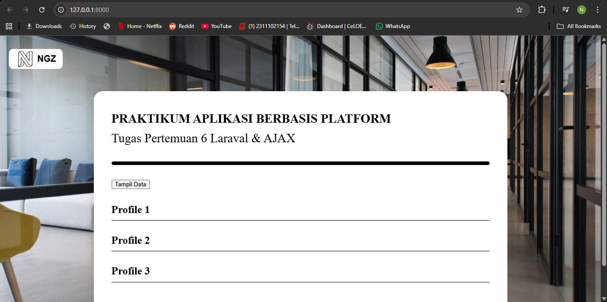
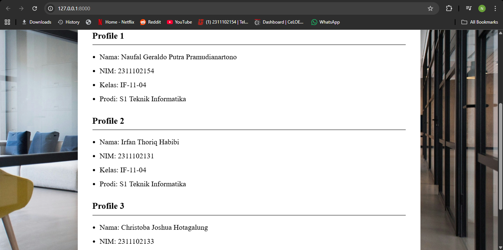

# ABP-Laravel-Ajax
Naufal Geraldo Putra Pramudianartono
2311102154
IF-11-04
Repository untuk Tugas Laravel dan AJAX Praktikum ABP

<h1 align="center">LAPORAN PRAKTIKUM APLIKASI BERBASIS PLATFORM</h1>

<br>

<h2 align="center">TUGAS L & A </h2>

<br><br>

<p align="center">

</p>
<br><br><br>

<h2 align="center">Disusun Oleh :</h2>

<p align="center" style="font-size:28px;">
  <b>Naufal Geraldo Putra Pramudianartono</b><br>
  <b>2311102154</b><br>
  <b>S1 IF-11-REG 04</b>
</p>
<br>
<h2 align="center">Dosen Pengampu :</h2>

<p align="center" style="font-size:28px;">
  <b>Cahyo Prihantoro, S.Kom., M.Eng </b>
</p>
<br>

<br>
<h1 align="center">LABORATORIUM HIGH PERFORMANCE</h1>
<h1 align="center">FAKULTAS INFORMATIKA</h1>
<h1 align="center">UNIVERSITAS TELKOM PURWOKERTO</h1>
<h1 align="center">TAHUN 2026</h1>

<hr>

## Dasar Teori
<h4>Laravel</h4>
<p>CRUD adalah singkatan dari Create (membuat), Read (membaca), Update (memperbarui), dan Delete (menghapus), yang merupakan empat operasi dasar dalam pengelolaan data pada basis data (database)<p>
<h4>AJAX</h4>
<p>Node.js adalah runtime environment untuk JavaScript yang bersifat open-source dan cross-platform. Dengan Node.js kita dapat menjalankan kode JavaScript di mana pun, tidak hanya terbatas pada lingkungan browser. Node.js menjalankan V8 JavaScript engine (yang juga merupakan inti dari Google Chrome) di luar browser. Ini memungkinkan Node.js memiliki performa yang tinggi.<p>

## Cooding Program
### Profilecontroller.php
<p>Berikut adalah file bagian controller dari MVC (Model, View, Controller) yang berisi fungsi memberi tahu dimana data json berada lalu file json tersebut tampilkan di bagian view serta juga berisi fungsi memberi data hanya saat dipanggil klien melewati AJAX</p>
```php
<?php

namespace App\Http\Controllers;

use Illuminate\Http\Request;
use Illuminate\Support\Facades\File;

class profileController extends Controller
{
    public function index()
    {
        $path = storage_path("app/profile.json");
        $json = File::get($path);
        $data = json_decode($json, true);

        return view("profile", $data);
    }

    public function getData()
    {
        $path = storage_path("app/profile.json");
        $json = File::get($path);
        $data = json_decode($json, true);

        return response ()->json($data);
    }
}
```

### profile.json
<p>Berikut file json yang berisi data mahasiswa yang akan ditampilkan</p>
```json
{
    "profile" : [
        "Nama: Naufal Geraldo Putra Pramudianartono",
        "NIM: 2311102154",
        "Kelas: IF-11-04",
        "Prodi: S1 Teknik Informatika"
    ],
    "profile2" : [
        "Nama: Irfan Thoriq Habibi",
        "NIM: 2311102131",
        "Kelas: IF-11-04",
        "Prodi: S1 Teknik Informatika"
    ],
    "profile3" : [
        "Nama: Christoba Joshua Hotagalung",
        "NIM: 2311102133",
        "Kelas: IF-11-04",
        "Prodi: S1 Teknik Informatika"
    ]
}
```

### web.php
<p>Berikut adalah file yang mengkontrol rute dari fungsi dalam controller</p>
```php
<?php

use Illuminate\Support\Facades\Route;
use App\Http\Controllers\profileController;

Route::get('/1', function () {
    return view('welcome');
});

Route::get('/', [profileController::class, 'index']);
Route::get('/profile', [profileController::class, 'getData']);
```

### profile.blade.php
<p>Berikut adalah file yang akan ditampilkan kepada user. Berisi script javascript yang mengontrol tombol untuk menampilkan data dengan menggunakan fungsi getdata pada file controller lalu profile-list, profile-list2, dan profile-list3 akan di decode dari json menjadi list html menggunakan dan akan ditampilkan menggunakan fetch API AJAX</p>
```php
<!DOCTYPE html>
<html lang="en">

<head>
    <meta charset="UTF-8">
    <meta name="viewport" content="width=device-width, initial-scale=1.0">
    <title>CV NGZ</title>
    <link rel="stylesheet" href="{{ asset('css/style.css') }}">
    <script src="https://kit.fontawesome.com/791ffebf52.js" crossorigin="anonymous"></script>
</head>

<body>
    <div class="bg" style="background-image: url('{{ asset('images/office.jpg') }}');"></div>
    <div class="content">
        <div class="icons">
            <div class="icon-brand">
                <i class="fa-brands fa-neos"></i>
                <p>NGZ</p>
            </div>
        </div>

        <div class="cv-card">

            <div class="cv-header">
                <div class="text-container">
                    <table class="info-table">
                        <tr>
                            <td><b>PRAKTIKUM APLIKASI BERBASIS PLATFORM</b></td>
                        </tr>
                        <tr>
                            <td>Tugas Pertemuan 6 Laraval & AJAX</td>
                        </tr>
                    </table>
                </div>
            </div>

            <div class="footer-bar"></div>

            <div class="cv-data" id="dataCv">

                <div id="ajax-btn">
                    <button>Tampil Data</button>
                </div>

                <h3>Profile 1</h3>
                <ul id="profile-list"></ul>

                <h3>Profile 2</h3>
                <ul id="profile-list2"></ul>

                <h3>Profile 3</h3>
                <ul id="profile-list3"></ul>

            </div>
        </div>
    </div>
    <script>
        document.getElementById('ajax-btn').addEventListener('click', function () {
            const btn = document.getElementById('ajax-btn');
            const cv = document.getElementById('dataCv');
            const profileList = document.getElementById('profile-list');
            const profileList2 = document.getElementById('profile-list2');
            const profileList3 = document.getElementById('profile-list3');
            const expList = document.getElementById('exp-list');

            btn.innerHTML = '<i>Data Telah Ditampilkan</i>';
            btn.disabled = true;

            fetch('/profile')
                .then(response => {
                    if (!response.ok) throw new Error('Gagal mengambil data JSON');
                    return response.json();
                })
                .then(data => {
                    let profileHtml = '';
                    data.profile.forEach(item => {
                        profileHtml += `<li>${item}</li>`;
                    });
                    profileList.innerHTML = profileHtml;

                    let profileHtml2 = '';
                    data.profile2.forEach(item => {
                        profileHtml2 += `<li>${item}</li>`;
                    });
                    profileList2.innerHTML = profileHtml2;

                    let profileHtml3 = '';
                    data.profile3.forEach(item => {
                        profileHtml3 += `<li>${item}</li>`;
                    });
                    profileList3.innerHTML = profileHtml3;

                    cv.style.display = 'block';
                    document.getElementById('ajax-btn').style.display = 'none';
                })
        });
    </script>
</body>

</html>
```
## Hasil
### Sebelum 
<p>Sebelum click tombol Tampil Data 3 mahasiswa </p>

### Setelah
<p>Setelah click tombol Tampil Data 3 mahasiswa </p>

